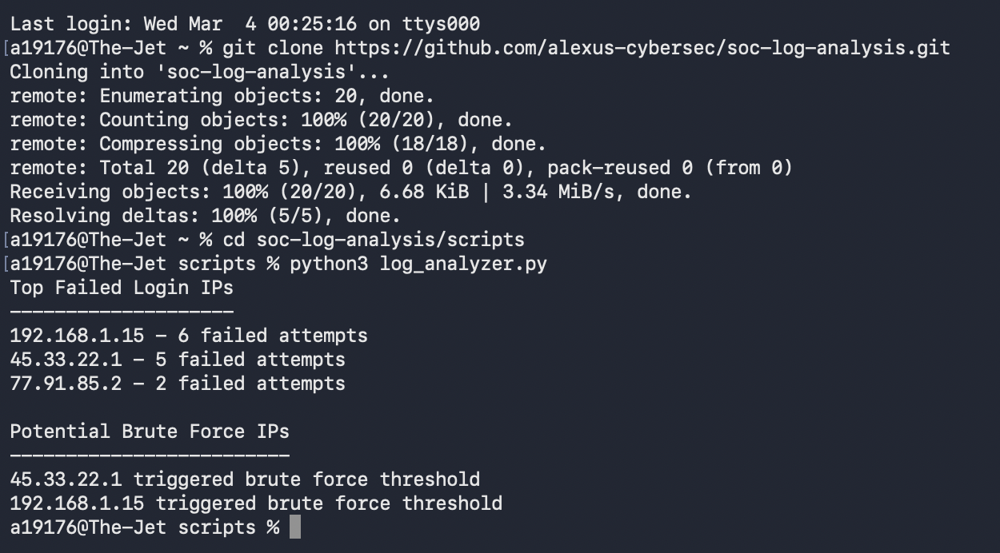

# soc-log-analysis
SOC log analysis demonstrating authentication log triage, brute force detection, and basic security automation using Python.

## Example Script Output

The Python script analyzes authentication logs and identifies suspicious login activity.

## Findings

The detection logic flags any IP address with five or more failed authentication attempts as a potential brute force source.

Two IP addresses exceeded the brute force detection threshold.

192.168.1.15 — 6 failed login attempts  
45.33.22.1 — 5 failed login attempts  

These patterns indicate possible brute force attempts against the SSH authentication service.

## Recommended Mitigations

• Restrict SSH access to trusted IP ranges  
• Enable multi-factor authentication for remote access  
• Configure login rate limiting and account lockout policies  
• Forward authentication logs to a SIEM for monitoring and alerting
